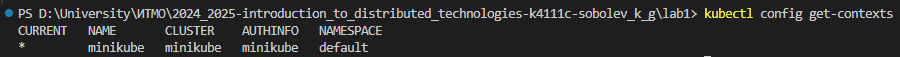
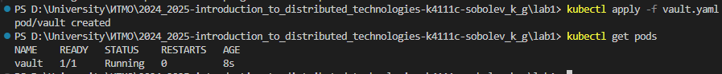
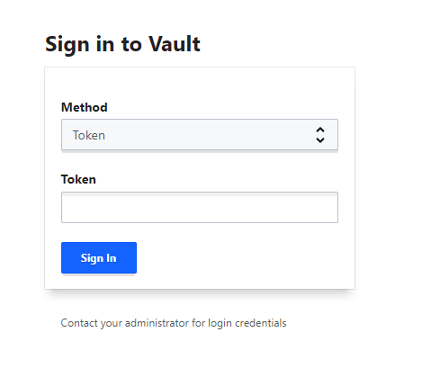
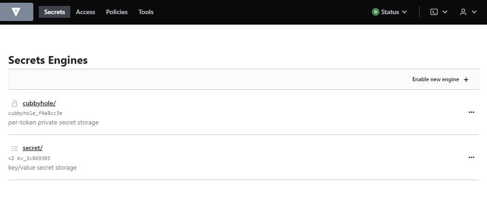
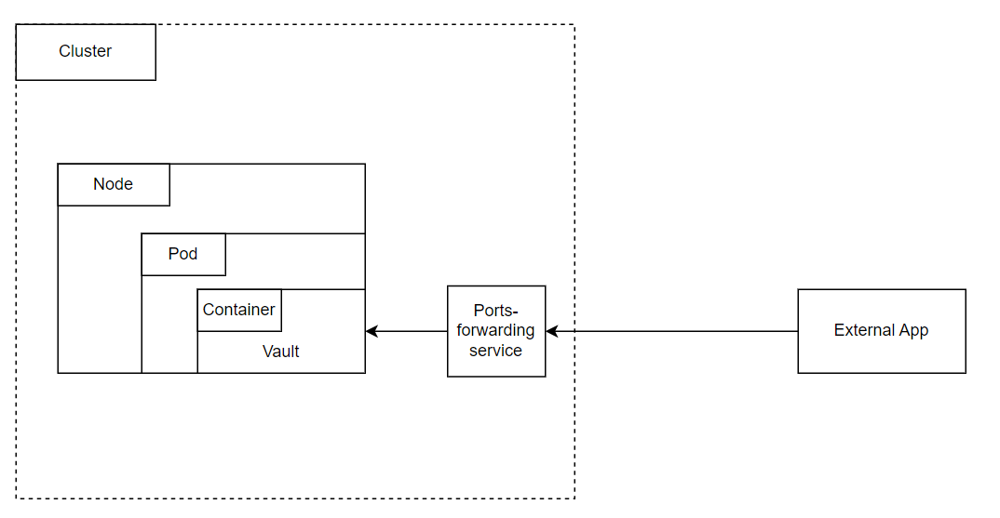

University: [ITMO University](https://itmo.ru/ru/)

Faculty: [FICT](https://fict.itmo.ru)

Course: [Introduction to distributed technologies](https://github.com/itmo-ict-faculty/introduction-to-distributed-technologies)

Year: 2024/2025

Group: K4111c

Author: Sobolev Konstantin Gennadievich

Lab: Lab1

Date of create: 17.11.2024

Date of finished: 17.1.2024

---

## Лабораторная работа №1 "Установка Docker и Minikube, мой первый манифест."

### Описание
Это первая лабораторная работа в которой вы сможете протестировать Docker, установить Minikube и развернуть свой первый "под".

---

### Цель работы
Ознакомиться с инструментами Minikube и Docker, развернуть свой первый "под".

---
### Ход работы

1. Установливаем Docker

2. Установливаем Minikube

3. Запускаем minikube командой `minikube start --driver=docker`

4. Проверим статус командой `kubectl config get-contexts`

5. Создаем [yaml файл](./vault.yaml) с настройками нашего будущего пода

6. Применим манифест командой `kubectl apply -f vault.yaml`

7. Создадим сервис для доступа к контейнеру
`kubectl expose pod vault --type=NodePort --port=8200`

8. Прокинем порты командой `kubectl port-forward service/vault 8200:8200`

9. Проверим, что сервис запущен

10. Найдем токен для входа в логах сервиса с помощью команды `kubectl logs vault`

11. Проверим корректность найденного токена

---

### Ответы на вопросы

#### 1. Что сейчас произошло и что сделали команды указанные ранее?
`minikube start --driver=docker` - запуск кластера

`kubectl apply -f vault.yaml` - применение манифеста к кластеру

`kubectl expose pod vault --type=NodePort --port=8200` - создание сервиса

`kubectl port-forward service/vault 8200:8200` - проброс портов

`kubectl logs vault` - получение логов пода

#### 2. Где взять токен для входа в Vault?
Токен можно получить, посмотрев логи с помощью команды `kubectl logs vault`

---

### Схема организации контейнеров и сервисов

