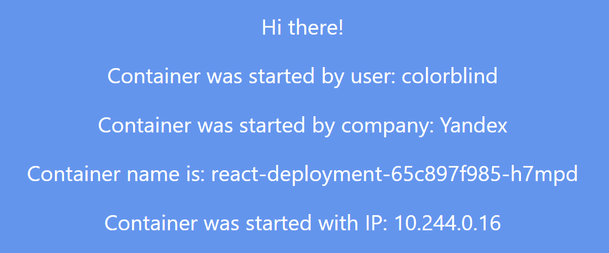

University: [ITMO University](https://itmo.ru/ru/)

Faculty: [FICT](https://fict.itmo.ru)

Course: [Introduction to distributed technologies](https://github.com/itmo-ict-faculty/introduction-to-distributed-technologies)

Year: 2024/2025

Group: K4111c

Author: Sobolev Konstantin Gennadievich

Lab: Lab2

Date of create: 19.11.2024

Date of finished: 20.11.2024

---

## Лабораторная работа №2 "Развертывание веб сервиса в Minikube, доступ к веб интерфейсу сервиса. Мониторинг сервиса."

### Описание
В данной лабораторной работе вы познакомитесь с развертыванием полноценного веб сервиса с несколькими репликами.

---

### Цель работы
Ознакомиться с типами "контроллеров" развертывания контейнеров, ознакомится с сетевыми сервисами и развернуть свое веб приложение.

---
### Ход работы

1. Создаем [манифест деплоймента](./deployment.yaml) и применяем его командой `kubectl apply -f ./deployment.yaml`

2. Создаем [манифест сервиса](./service.yaml) и применяем его командой `kubectl apply -f ./service.yaml`.
 Будем использовать тип LoadBalancer для распределения нагрузки между инстансами

3. Запускаем `minikube tunnel` для получения external-ip

4. Обратившись по адресу `<external-ip>:<port>` получаем необходимую страницу, при этом из-за работы балансировщика при
 открытии новой страницы мы попадаем на другой инстанс из-за чего видим другой ip и container-name

5. Посмотрим логи подов

---

### Схема организации контейнеров и сервисов

