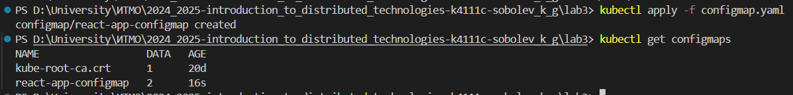
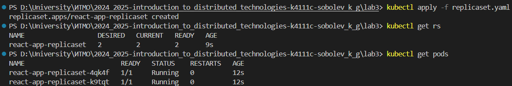
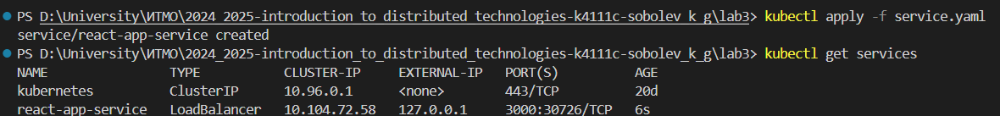
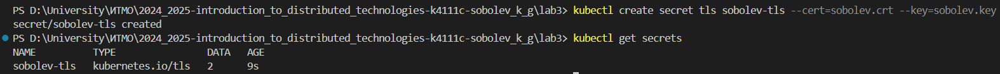
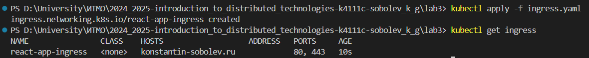
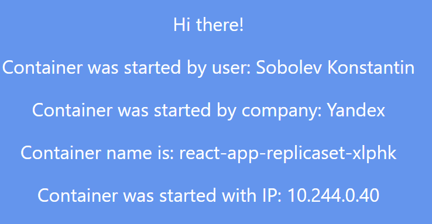
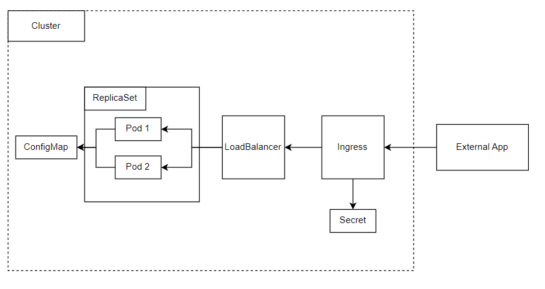

University: [ITMO University](https://itmo.ru/ru/)

Faculty: [FICT](https://fict.itmo.ru)

Course: [Introduction to distributed technologies](https://github.com/itmo-ict-faculty/introduction-to-distributed-technologies)

Year: 2024/2025

Group: K4111c

Author: Sobolev Konstantin Gennadievich

Lab: Lab3

Date of create: 7.12.2024

Date of finished: 7.12.2024

---

## Лабораторная работа №3 "Сертификаты и "секреты" в Minikube, безопасное хранение данных."

### Описание
В данной лабораторной работе вы познакомитесь с сертификатами и "секретами" в Minikube, правилами безопасного хранения данных в Minikube.

---

### Цель работы
Познакомиться с сертификатами и "секретами" в Minikube, правилами безопасного хранения данных в Minikube.

---
### Ход работы
1. Создадим [ConfigMap](./configmap.yaml) и поместим в него необходимые переменные. Применим его с помощью команды `kubectl apply -f configmap.yaml`


2. Создадим [ReplicaSet](./replicaset.yaml). Применим его с помощью команды `kubectl apply -f replicaset.yaml`


3. Скопируем [Service](./service.yaml) из второй лабораторной работы. Применим его с помощью команды `kubectl apply -f service.yaml` и включим `minikube tunnel` для доступа к нему


4. Сгенерируем и подпишем сертификат
```
openssl genrsa -out sobolev.key 4096
openssl req -key sobolev.key -new -out sobolev.csr
openssl x509 -signkey sobolev.key -in sobolev.csr -req -days 90 -out sobolev.crt
```

5. Создадим секрет для сертификата с помощью команды `kubectl create secret tls sobolev-tls --cert=sobolev.crt --key=sobolev.key`


6. Добавим `127.0.0.1 konstantin-sobolev.ru` в `/etc/hosts`

7. Включим Ingress `minikube addons enable ingress`.  Создадим [Ingress](./ingress.yaml). Применим его с помощью команды `kubectl apply -f ingress.yaml`


8. Проверим работу в браузере



---

### Схема организации контейнеров и сервисов


