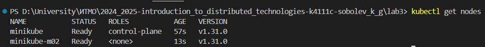
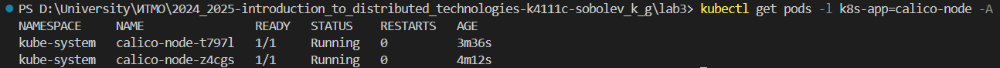
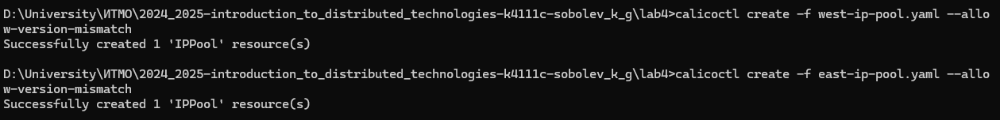
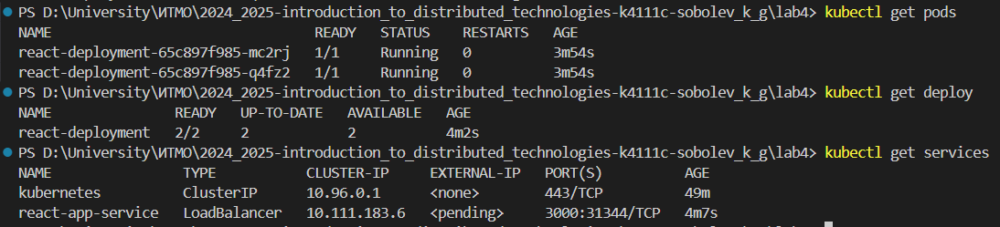
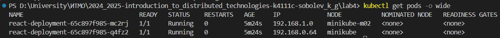
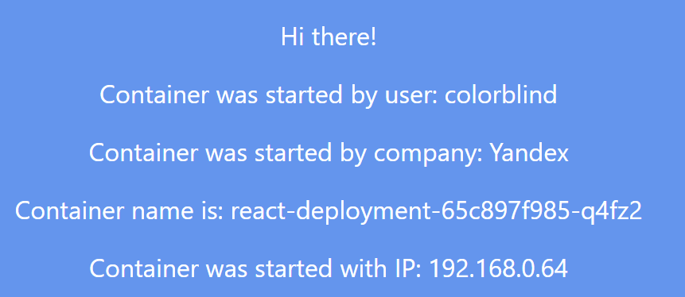
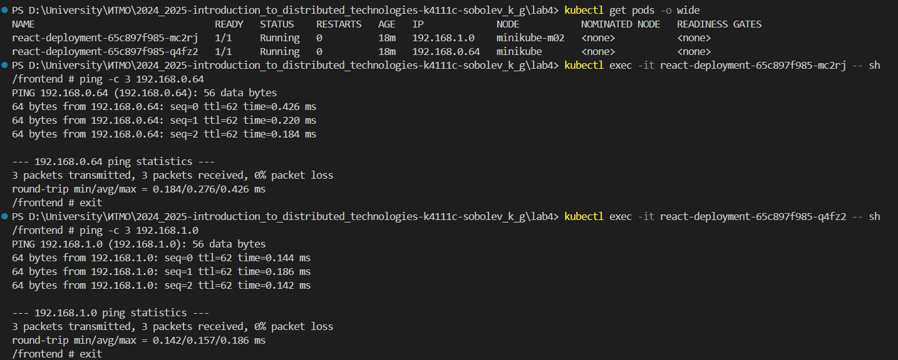
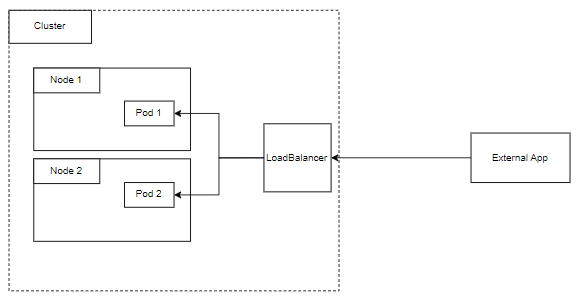

University: [ITMO University](https://itmo.ru/ru/)

Faculty: [FICT](https://fict.itmo.ru)

Course: [Introduction to distributed technologies](https://github.com/itmo-ict-faculty/introduction-to-distributed-technologies)

Year: 2024/2025

Group: K4111c

Author: Sobolev Konstantin Gennadievich

Lab: Lab3

Date of create: 8.12.2024

Date of finished: 8.12.2024

---

## Лабораторная работа №4 "Сети связи в Minikube, CNI и CoreDNS"

### Описание
Это последняя лабораторная работа в которой вы познакомитесь с сетями связи в Minikube. Особенность Kubernetes заключается в том, что у него одновременно работают underlay и overlay сети, а управление может быть организованно различными CNI.

---

### Цель работы
Познакомиться с CNI Calico и функцией IPAM Plugin, изучить особенности работы CNI и CoreDNS.

---
### Ход работы
1. Установим плагин `CNI=calico` и режим работы `Multi-Node Clusters` при запуске minikube, выполнив команду
`minikube start --network-plugin=cni --cni=calico --nodes=2 --driver=docker`
(предварительно удалив существующий кластер с помощью команды `minikube delete`)

Спустя какое-то время видим поды calico в статусе running

2. Создадим манифесты для двух IP пулов [west-ip-pool.yaml](./west-ip-pool.yaml) [east-ip-pool.yaml](./east-ip-pool)

3. Применим пулы с помощью команд `calicoctl create -f west-ip-pool.yaml --allow-version-mismatch` и `calicoctl create -f east-ip-pool.yaml --allow-version-mismatch`, предварительно удалив дефолтный с помощью команды `kubectl delete ippool default-ipv4-ippool`

4. Назначим соответсвутющие лейблы существующим нодам с помощью команд
`kubectl label node minikube zone=west` и `kubectl label node minikube-m02 zone=east`

5. Возьмем манифесты для deployment и service из предыдущих лабораторных работ и применим их

6. Посмотрим ip адреса подов с помощью команды `kubectl get pods -o wide` и убедимся, что они находятся на разных нодах нашего кластера

7. Проверим работу в браузере

8. Проверим работу ping между подами

---

### Схема организации контейнеров и сервисов

